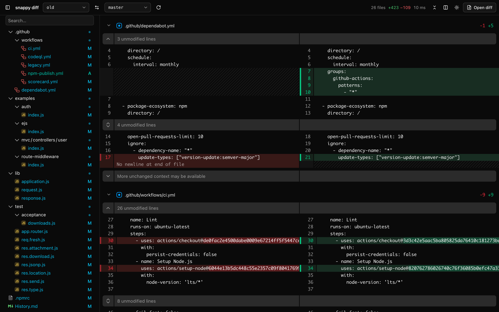

# snappy diff

An insanely fast side-by-side diff viewer for git branches and patch files.



## Install

macOS and Linux:

```bash
curl -fsSL https://raw.githubusercontent.com/duartecaldascardoso/snappy-diff/main/install.sh | sh
```

Windows (PowerShell):

```powershell
irm https://raw.githubusercontent.com/duartecaldascardoso/snappy-diff/main/install.ps1 | iex
```

## Usage

```bash
snappy-diff                 # default branch vs. current branch
snappy-diff main feature    # main...feature
snappy-diff -w              # default branch vs. uncommitted changes
snappy-diff change.diff     # a .diff / .patch file
git diff | snappy-diff -    # a diff from stdin
```

You can also drop or paste a diff into the page.

`/` searches files, `j` / `k` jump between files, `⌘B` toggles the sidebar.

## Build from source

Requires Rust and Node.

```bash
npm --prefix ui ci && npm --prefix ui run build
cargo install --path .
```
